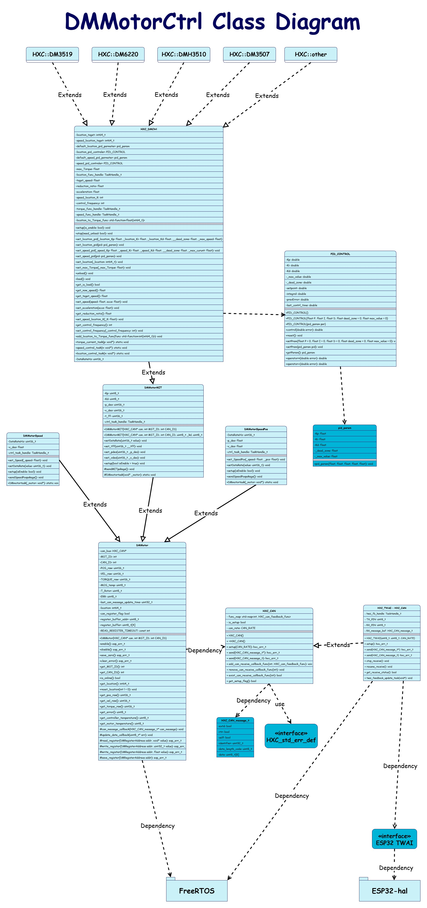
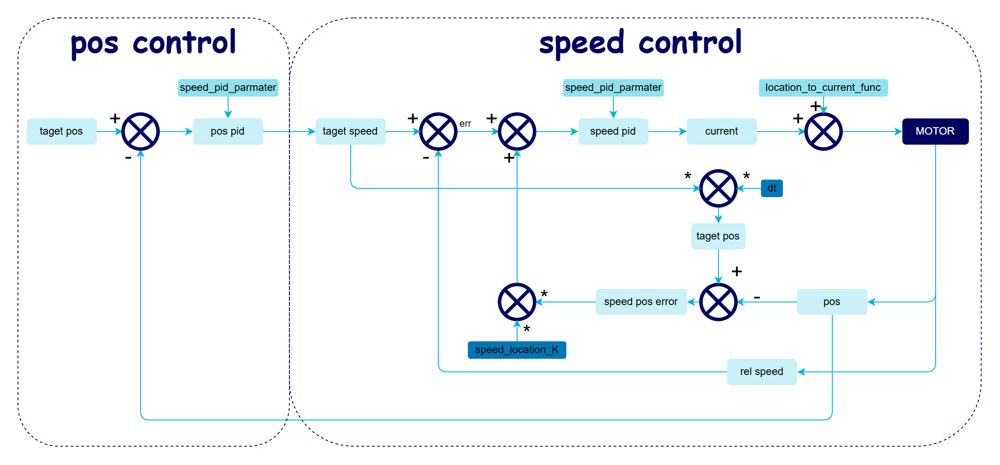

# DMMotorCtrl
重庆邮电大学HXC战队开源
readme持续更新中
# Contributors

# V1.0.0
# 概述

该c++模块可用于esp32芯片的达妙电机控制。也可轻易移植到其他平台
esp32系列只需要外挂一颗CAN收发器，即可实现电机控制。

本文档提供了用于控制达妙电机的DMMotorCtrl模块的详细API说明。

## 类图

## 控制算法
本电机库在使用如下图的控制方式

